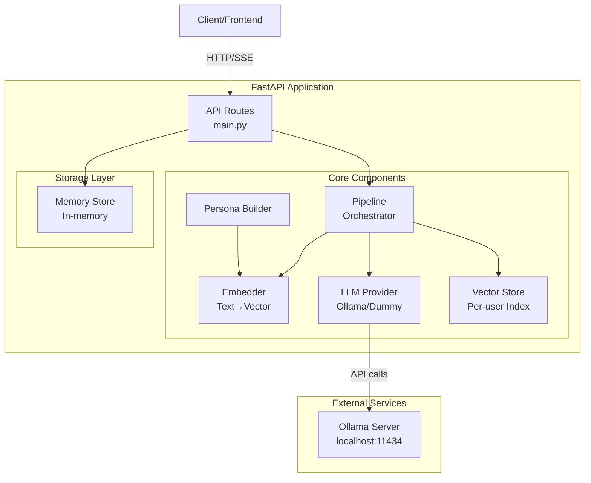
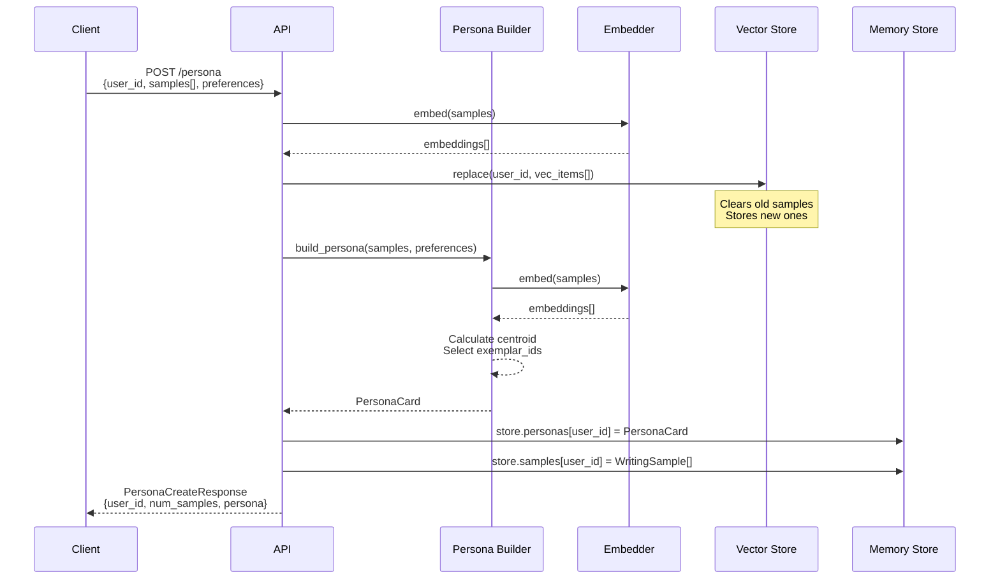
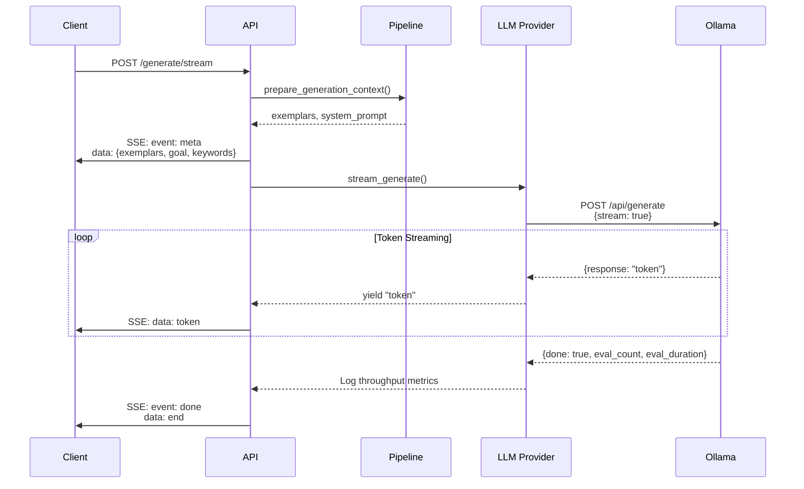
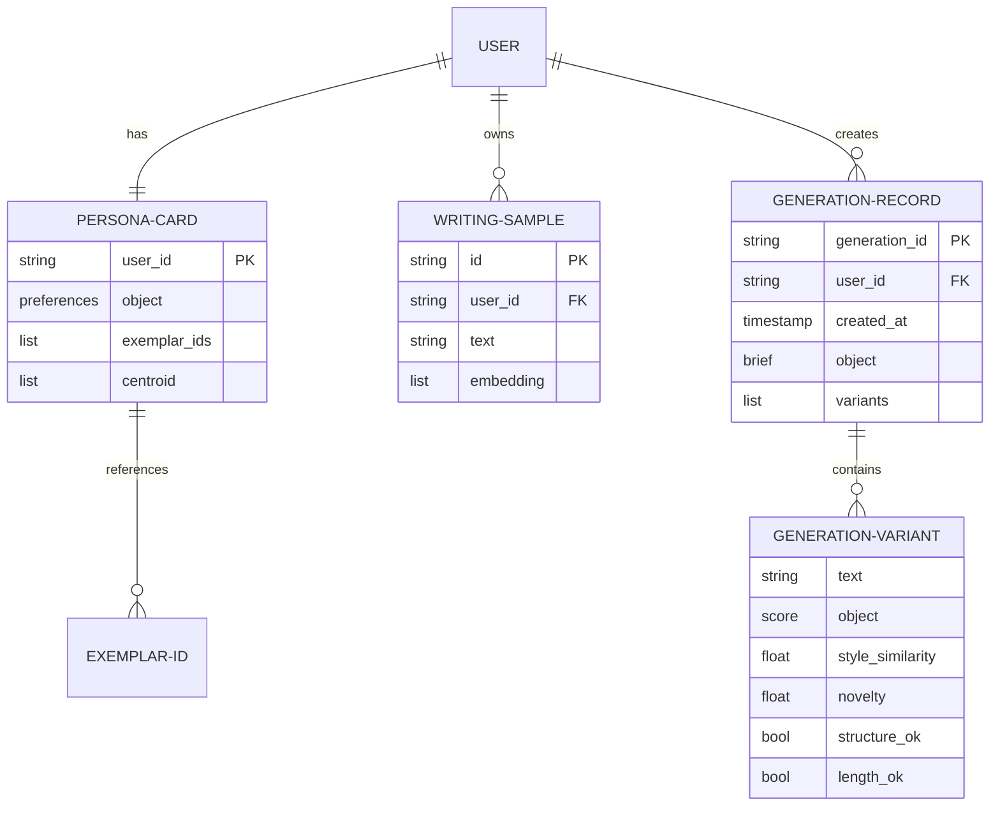
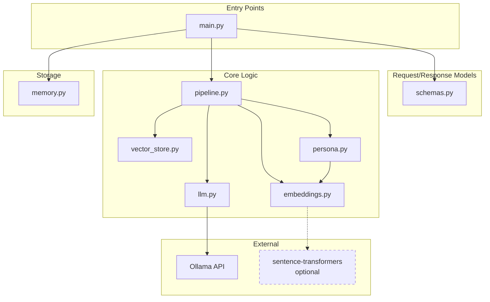
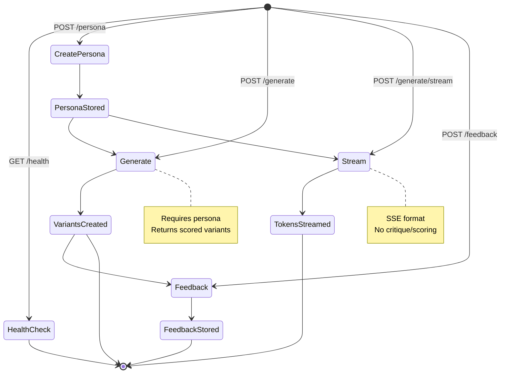

# stylgen_v0 Architecture Diagrams

## 1. High-Level System Overview



## 2. Persona Creation Flow



## 3. Generation Pipeline (Detailed)

```mermaid
flowchart TB
    Start([Generation Request])
    
    subgraph "1. Retrieval Phase"
        GetPersona[Load PersonaCard<br/>from Memory]
        CheckExemplars{Has<br/>exemplar_ids?}
        UseExemplars[Fetch exemplars<br/>by ID]
        QueryVectors[Query vectors with<br/>centroid embedding]
        GetSamples[Get top-k similar<br/>samples via cosine]
    end
    
    subgraph "2. Prompt Construction"
        BuildSystem[Build System Prompt<br/>- Tone descriptors<br/>- Formality level<br/>- Emoji/hashtag rules<br/>- Banned phrases<br/>- Structure preference]
        BuildUser[Build User Prompt<br/>- Brief keywords<br/>- Goal & audience<br/>- Length hint<br/>- CTA & link<br/>- Exemplar snippets]
    end
    
    subgraph "3. LLM Generation"
        SetTemp{Custom<br/>temperature?}
        UseCustom[Use provided<br/>temperature]
        Alternate[Alternate between<br/>0.6 and 0.8]
        CallLLM[Call LLM Provider<br/>with prompts]
        HandleError{LLM<br/>available?}
        UseDummy[Use Dummy<br/>Provider]
    end
    
    subgraph "4. Critique & Polish"
        RemoveBanned[Remove banned phrases<br/>via regex]
        NormalizeWS[Normalize whitespace<br/>preserve line breaks]
        CheckLength[Check length<br/>60-140% of hint]
    end
    
    subgraph "5. Scoring"
        StyleSim[Calculate style similarity<br/>cosine(text, centroid)]
        Novelty[Calculate novelty<br/>1 - max_sim(text, samples)]
        Structure[Check structure<br/>requirements]
        CompositeScore[Composite scoring<br/>style + novelty + constraints]
    end
    
    subgraph "6. Selection"
        SortVariants[Sort variants<br/>by score]
        SelectBest[Select top as<br/>'chosen']
        Package[Package response<br/>with generation_id]
    end
    
    Start --> GetPersona
    GetPersona --> CheckExemplars
    CheckExemplars -->|Yes| UseExemplars
    CheckExemplars -->|No| QueryVectors
    QueryVectors --> GetSamples
    UseExemplars --> BuildSystem
    GetSamples --> BuildSystem
    
    BuildSystem --> BuildUser
    BuildUser --> SetTemp
    SetTemp -->|Yes| UseCustom
    SetTemp -->|No| Alternate
    UseCustom --> CallLLM
    Alternate --> CallLLM
    CallLLM --> HandleError
    HandleError -->|Success| RemoveBanned
    HandleError -->|Fail| UseDummy
    UseDummy --> RemoveBanned
    
    RemoveBanned --> NormalizeWS
    NormalizeWS --> CheckLength
    CheckLength --> StyleSim
    StyleSim --> Novelty
    Novelty --> Structure
    Structure --> CompositeScore
    CompositeScore --> SortVariants
    SortVariants --> SelectBest
    SelectBest --> Package
    Package --> End([Return Response])
```

## 4. Streaming Generation Flow



## 5. Data Model Relationships



## 6. Embedding & Retrieval Flow

```mermaid
flowchart LR
    subgraph "Text Processing"
        Input[Raw Text]
        Token[Tokenize<br/>lowercase, split]
        Hash[Hash tokens<br/>BLAKE2b]
        Vector[Build sparse vector<br/>dim=384]
        Norm[L2 Normalize]
    end
    
    subgraph "Storage"
        VecItem[VecItem<br/>{id, text, vec}]
        UserIndex[(Per-user Index)]
    end
    
    subgraph "Retrieval"
        Query[Query Vector]
        Cosine[Cosine Similarity<br/>dot(a,b) / ||a||·||b||]
        TopK[Select top-k<br/>by similarity]
    end
    
    Input --> Token
    Token --> Hash
    Hash --> Vector
    Vector --> Norm
    Norm --> VecItem
    VecItem --> UserIndex
    
    Query --> Cosine
    UserIndex --> Cosine
    Cosine --> TopK
```

## 7. Component Dependencies



## 8. Critique & Scoring Detail

```mermaid
flowchart TB
    Text[Generated Text]
    
    subgraph "Critique Phase"
        BannedList[Global Banned +<br/>User Taboo Phrases]
        Regex[Word-boundary<br/>case-insensitive regex]
        Remove[Remove all matches]
        Normalize[Normalize whitespace<br/>s+→s, \\t→space]
    end
    
    subgraph "Length Check"
        CalcLen[Calculate length]
        Compare[Compare to hint]
        InRange{60-140%<br/>of hint?}
        LengthOK[length_ok = true]
        LengthFail[length_ok = false]
    end
    
    subgraph "Style Scoring"
        EmbedText[Embed text]
        GetCentroid[Get persona<br/>centroid]
        CosineSim[cosine(text_emb,<br/>centroid)]
        StyleScore[style_similarity<br/>0.0-1.0]
    end
    
    subgraph "Novelty Scoring"
        AllSamples[Get all user<br/>samples]
        MaxSim[Find max similarity<br/>to any sample]
        NoveltyCalc[novelty =<br/>1 - max_sim]
        NoveltyScore[novelty<br/>0.0-1.0]
    end
    
    subgraph "Final Score"
        Composite[weighted_score =<br/>style * 0.5 +<br/>novelty * 0.3 +<br/>constraints * 0.2]
    end
    
    Text --> BannedList
    BannedList --> Regex
    Regex --> Remove
    Remove --> Normalize
    
    Normalize --> CalcLen
    CalcLen --> Compare
    Compare --> InRange
    InRange -->|Yes| LengthOK
    InRange -->|No| LengthFail
    
    Normalize --> EmbedText
    EmbedText --> CosineSim
    GetCentroid --> CosineSim
    CosineSim --> StyleScore
    
    EmbedText --> MaxSim
    AllSamples --> MaxSim
    MaxSim --> NoveltyCalc
    NoveltyCalc --> NoveltyScore
    
    StyleScore --> Composite
    NoveltyScore --> Composite
    LengthOK --> Composite
    LengthFail --> Composite
```

## 9. API Request Flow



## Usage Notes

These diagrams show:
1. **System Overview**: How components connect
2. **Persona Creation**: Step-by-step user profile building
3. **Generation Pipeline**: Detailed 6-phase generation process
4. **Streaming**: Real-time token generation flow
5. **Data Models**: Entity relationships
6. **Embedding/Retrieval**: Vector search mechanics
7. **Dependencies**: Module interconnections
8. **Critique/Scoring**: Post-processing detail
9. **API Flow**: Request state transitions

Each diagram focuses on a specific aspect to help understand the granular workflow.